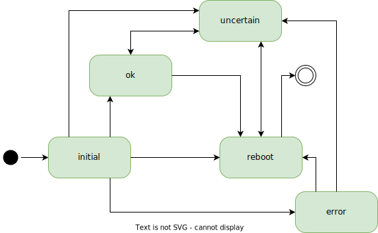

# conditional-reboot
[](https://goreportcard.com/report/github.com/soerenschneider/conditional-reboot)

conditional-reboot orchestrates the execution of reboots across server fleets to ensure security and stability of your infrastructure.
Primarily it is aimed at executing pending security updates but also to recover from sudden network loss due to faulty drivers and / or hardware for machines thousands of kilometres away.

## Features

🚨 Automatic reboot on pending security updates

🐞 Automatic reboot on buggy drivers / network adapters after network loss

⏲  Allows setting time-based schedules when it's safe to reboot

🚦 Allows defining fine-grained conditions to combine multiple input sources

📫 Keeps an audit log of reboots

☔️ Safety net that prevents reboot loops


## Installation

### From Binary

Head over to the [prebuilt binaries](https://github.com/soerenschneider/conditional-reboot/releases) and download the correct binary for your system. Alternatively, if you 
have [Golang SDK](https://go.dev/dl/) installed, you can install it from source by invoking:

```text
go install github.com/soerenschneider/conditional-reboot@latest
```

Use the example [systemd service file](contrib/conditional-reboot.service) to run it at boot.

### Example Configuration
You can use the [example configuration](contrib/example.json). Download the file and place it to `/etc/conditional-reboot.json`, the default location for its config file.

```json
{
  "groups": [
    {
      "name": "lost connectivity",
      "state_evaluator_name": "and",
      "state_evaluator_args": {
        "reboot": "30m"
      },
      "agents": [
        {
          "checker_name": "tcp",
          "checker_args": {
            "host": "8.8.8.8",
            "port": "53"
          },
          "check_interval": "1m",
          "streak_until_ok": 1,
          "streak_until_reboot": 3
        },
        {
          "checker_name": "tcp",
          "checker_args": {
            "host": "1.1.1.1",
            "port": "53"
          },
          "check_interval": "1m",
          "streak_until_ok": 1,
          "streak_until_reboot": 3
        }
      ]
    }
  ]
}
```

This configuration defines a group of two checkers that respectively check whether Google's or Cloudflare's DNS server answer via TCP.
On 3 consecutive failures to get an answer, the checker transitions into the state of `reboot`, signalling the checker wants the system to be rebooted. The `state_evaluator` is configured
to actually perform a reboot if **both** checkers reside in state `reboot` **for at least 30 minutes**.

Even though it's a highly unlikely scenario that both Google's and Cloudflare's public DNS servers are offline at the same time for more than 30 minutes, this scenario obviously only serves as an oversimplified example. It probably makes more sense to (also) check for servers inside your local network, such as your router.

## Example scenarios
| Scenario                            | Description                                                                                                                                                                                                     |
|-------------------------------------|-----------------------------------------------------------------------------------------------------------------------------------------------------------------------------------------------------------------|
| [Example a](contrib/example_a.json) | Check whether pending kernel/microcode/service updates need to be applied via needrestart, but only between 02:00 and 03:00 each night. Reboot immediately if all configured local DNS servers fail to respond. |

## High Level Concepts

### Checkers
Checkers try to provide information to conditional-reboot to determine whether a reboot is needed or not.

Multiple checkers are available

| Name        | Description                                                                                                                                      |
|-------------|--------------------------------------------------------------------------------------------------------------------------------------------------|
| DNS         | Checks if a specified DNS server returns a reply to a query                                                                                      |
| File        | Checks for the existence or absence of a given file                                                                                              |
| ICMP        | Checks for a reply of an ICMP echo request (*ping*)                                                                                              |
| Kafka       | Checks for incoming request on a kafka topic                                                                                                     |
| Needrestart | Checks the output of [needrestart](https://github.com/liske/needrestart) to determine whether there are pending kernel/service/microcode updates |
| Prometheus  | Queries Prometheus API to check whether a reboot should be performed                                                                             |
| TCP         | Checks whether a TCP connection to a given server can be established                                                                             |

### Preconditions
Preconditions add the feature of running a checker only when a precondition is met. Currently, there are two preconditions defined

| Name        | Description                                        |
|-------------|----------------------------------------------------|
| always      | Invoke the checker at each tick                    |
| time_window | Only invoke the checker during a given time window |

### Agents
Agents combine a single checker with a precondition. Multiple agents form a group. Also, it's possible to define (optional) streaks.

With streaks defined, a state does not immediately change from `ok` to `reboot` or vice versa but needs n consecutive identical checker results to change a state.

| Name                | Description                                                                                                                    |
|---------------------|--------------------------------------------------------------------------------------------------------------------------------|
| streak_until_ok     |    A checker must return at least n consecutive results indicating no reboot is needed to recover and transition to state `ok` |
| streak_until_reboot |   A checker must return at least n consecutive results indicating a reboot is needed to transition to state `reboot`           |

### Groups
Groups are formed by [1, n] agents and a single state evaluator.

### State Evaluator
A state evaluator checks multiple agents within a group and emits a single based on the agents' status.

| Name | Description                                                 |
|------|-------------------------------------------------------------|
| and  | All agents within a group need to require a reboot          |
| or   | A single agent within a group is enough to request a reboot |

## Development

### States
| Name      | Description                                                                                                                                    |
|-----------|------------------------------------------------------------------------------------------------------------------------------------------------|
| initial   | No state known yet                                                                                                                             |
| ok        | Checker indicates that no reboot needed                                                                                                        |
| reboot    | Checker indicates that a reboot is needed                                                                                                      |
| error     | Error occurred while running checker                                                                                                           |
| uncertain | When streaks are configured, a checker only transitions to 'ok' or 'reboot' state after n consecutive positive / negative check results.       |

#### State Transitions


## Observability

All metrics are prefixed with `conditional_reboot`.

| Name                                 | Type     | Labels          |
|--------------------------------------|----------|-----------------|
| start_timestamp_seconds              | Gauge    |                 |
| heartbeat_timestamp_seconds          | Gauge    |                 |
| version                              | GaugeVec | version         |
| checker_last_check_timestamp_seconds | GaugeVec | checker         |
| checker_status                       | GaugeVec | checker, status |
| agent_state                          | GaugeVec | state, checker  |
| agent_state_change_timestamp_seconds | GaugeVec | state, checker  |
| invocation_errors_total              | Counter  |                 |

## Changelog
Check the [full changelog](CHANGELOG.md)